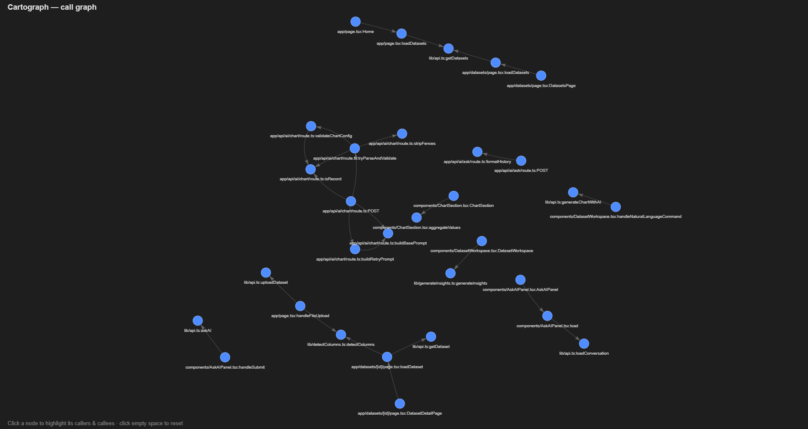

# Cartograph

[](https://github.com/willpiwowarski/cartograph/actions/workflows/ci.yml)

**A static-analysis tool that builds a type-resolved call graph of a TypeScript codebase — so you can ask structural questions about code instead of reading all of it.**



*Above: Cartograph's interactive call graph of a real Next.js application (~30 functions across `app/`, `components/`, and `lib/`). Click any node to highlight its callers and callees.*

## What it does

Cartograph parses a TypeScript project into its real syntax tree, resolves every function and method call to the exact definition it refers to, and builds a directed **call graph** (who-calls-whom). On top of that graph you can ask:

- **Who calls this?** — every direct caller of a function.
- **What breaks if I change this?** — every function that transitively depends on it (reverse transitive closure).
- **What does this depend on?** — everything a function transitively calls.
- **How does X reach Y?** — the actual call path between two functions.

It runs against the bundled `sample/` fixture *or* any real TypeScript project via its `tsconfig.json`, and renders the graph as an interactive, click-to-explore visualization (pictured above).

## Why it's not just grep

The naive way to answer "what calls `save`?" is to text-search for `save(`. That falls apart immediately: there may be twenty methods named `save`, the call may be renamed through an import (`import { save as persist }`), or it may be a method whose target depends on the receiver's type. Text matching cannot tell these apart.

Cartograph resolves calls through the **TypeScript type checker**, not text. Every edge in the graph is the result of real symbol resolution:

- **Methods** — `user.save()` resolves using the static type of `user`, so the correct `save` is found among many.
- **Imports & aliases** — a call written `sum(a, b)` correctly resolves to the imported `add` it was renamed from.
- **Inheritance & overrides** — a call on a subclass resolves to the override when present, or the inherited base method when not.
- **Arrow functions & expressions** — `const handleClick = () => …` is a first-class callable, resolved as both caller and callee. Anonymous callbacks (a lambda passed straight to `.map()`) are transparent, so calls inside them are attributed to the nearest *named* function rather than lost.

That is the difference between a fancy file viewer and a tool that actually understands the code's structure.

## The CLI

```
npx tsx src/cli.ts <command> [args] [--project <tsconfig.json>]

  edges                     List every call-graph edge.
  stats                     Node/edge counts, most-called functions, entry points.
  who-calls   <node>        Direct callers of <node>.
  what-breaks <node>        Everything that transitively depends on <node>.
  depends-on  <node>        Everything <node> transitively calls.
  path        <from> <to>   A call path from <from> to <to>, if one exists.
  viz                       Write viz/data.js for the interactive visualization.
```

Without `--project` it analyzes the bundled `sample/` fixture. Nodes are `file:name` (e.g. `app/page.tsx:Home`); you can pass just the name or any unique suffix and Cartograph resolves it — or lists the candidates if it's ambiguous.

## Running on a real codebase

Point Cartograph at any project through its own `tsconfig` (which is how path aliases like `@/*` get resolved). For a Next.js app, a thin config that scopes the analysis to first-party source is enough:

```jsonc
// tsconfig.cartograph.json
{
  "extends": "./tsconfig.json",
  "compilerOptions": { "incremental": false },
  "include": ["lib/**/*.ts", "app/**/*.ts", "app/**/*.tsx", "components/**/*.tsx"],
  "exclude": ["node_modules", ".next"]
}
```

Asking what a change would affect, on a real ~30-node app graph:

```
$ npx tsx src/cli.ts what-breaks detectColumns --project ../insightforge/tsconfig.cartograph.json

Functions that transitively depend on lib/detectColumns.ts:detectColumns (would be affected by a change):
  app/datasets/[id]/page.tsx:DatasetDetailPage
  app/datasets/[id]/page.tsx:loadDataset
  app/page.tsx:handleFileUpload
```

Cartograph filters calls down to first-party callables — calls into `node_modules` and `.d.ts` type declarations are excluded — so the graph is the *project's* structure, not the framework's.

## Example (sample fixture)

```
$ npx tsx src/cli.ts what-breaks add
Functions that transitively depend on sample/math.ts:add (would be affected by a change):
  sample/geometry.ts:perimeter
  sample/geometry.ts:total
  sample/handlers.ts:accumulate
  sample/handlers.ts:report
  sample/handlers.ts:summarize
  sample/math.ts:Calculator.cube
  sample/math.ts:Calculator.square
  sample/math.ts:double
  sample/math.ts:run

$ npx tsx src/cli.ts path report add
sample/handlers.ts:report
  -> sample/handlers.ts:summarize
  -> sample/handlers.ts:accumulate
  -> sample/math.ts:add
```

## How it works

1. **Parse** — [ts-morph](https://ts-morph.com), a wrapper over the TypeScript compiler, loads the project and exposes both the AST and the type checker.
2. **Resolve** — for every call expression, the callee is resolved to its declaration via the type checker (`getSymbol` → `getAliasedSymbol` → `getDeclarations`), handling methods, imports, aliases, inheritance, and arrow/expression callables.
3. **Build** — resolved caller → callee edges (deduplicated across call sites) are stored in a bidirectional adjacency structure (a forward *callees* map and a reverse *callers* map), so queries run in either direction.
4. **Query** — direct lookups are O(1); transitive-impact and path queries are breadth-first search over the graph.
5. **Visualize** — the graph is exported and rendered with vis-network as an interactive force-directed diagram; clicking a node highlights its callers and callees.

## Limitations (by design)

Cartograph resolves calls against **static** type information. Runtime **dynamic dispatch** — for example an `Animal`-typed variable that actually holds a `Dog` at runtime — is undecidable in general and intentionally not tracked; such calls resolve to the statically known method. This is a deliberate, documented boundary that every serious static-analysis tool draws.

## Getting started

```bash
npm install
npm test                              # run the verification suite
npm run cli -- stats                  # summarize the sample graph
npm run cli -- what-breaks add        # example structural query
npm run viz                           # regenerate viz/data.js, then open viz/index.html

# against a real project:
npm run cli -- stats --project /path/to/tsconfig.cartograph.json
```

## Testing

`npm test` runs [src/verify.ts](src/verify.ts) — a hand-traced source of truth for the `sample/` fixture. It checks the full edge set and every query type (direct, transitive, path), including the arrow-function and anonymous-callback-transparency cases. All checks must pass.

## Status & roadmap

Core analysis, the query CLI, real-codebase support via `tsconfig`, and the interactive visualization are complete and verified by an automated test suite. Planned next:

- An optional natural-language query layer that translates a question into a graph operation — the graph stays the source of truth, so no code structure is ever hallucinated.
